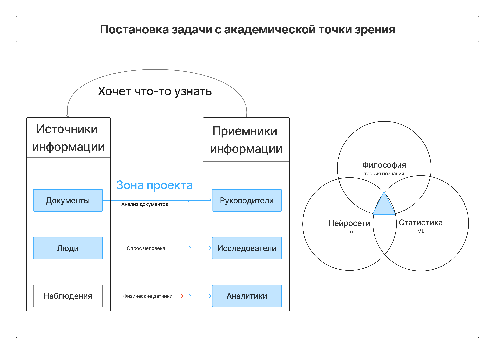
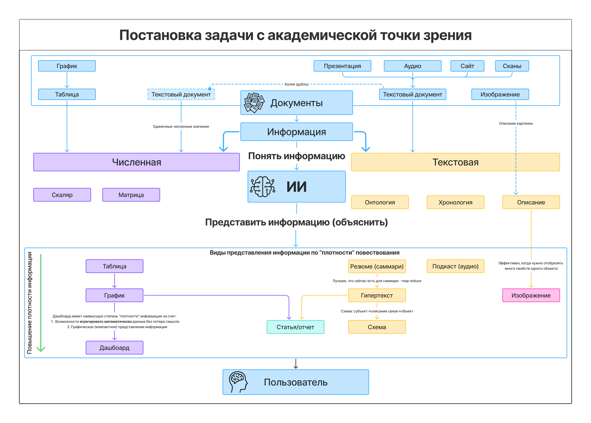
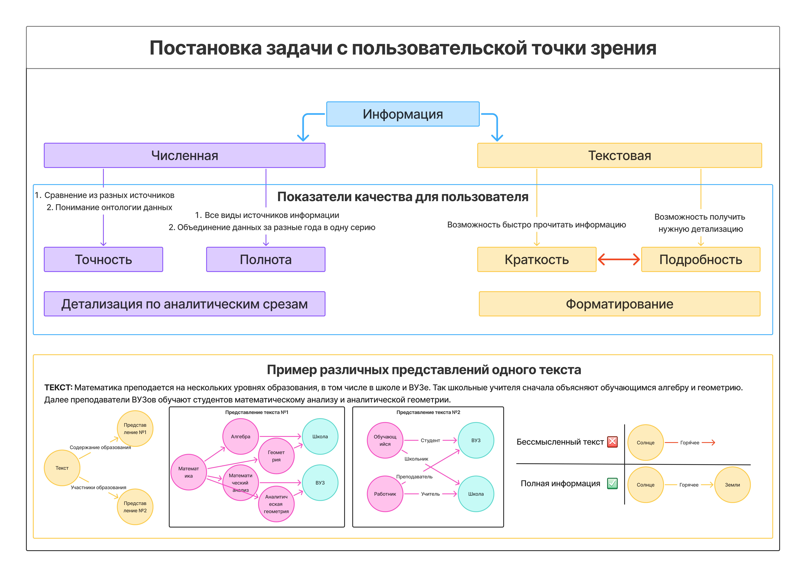
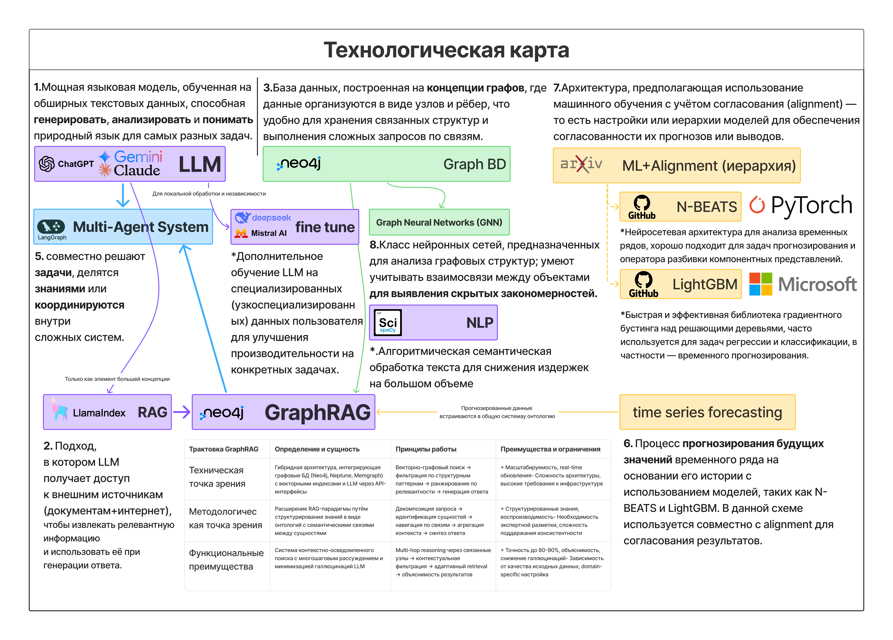

# Академическое обоснование

## Постановка задачи

## Показатели повышения точности и производительности

**1. [GraphRAG](glossary.md#технологии-работы-с-данными) для образовательной аналитики:**
- Повышение точности ответов **на 25-40%** по сравнению с традиционными подходами
- Точность извлечения фактов: **92%+** (GraphRAG-Bench показывает 89-94% для различных доменов)
- Снижение галлюцинаций: **до 15%** ложных утверждений (базовый [RAG](glossary.md#технологии-работы-с-данными): 25-30%)

**2. [Few-shot](glossary.md#основные-технологии-искусственного-интеллекта) обучение для специализированных задач:**
- Адаптация к новым типам документов с **85%+ точностью** при использовании всего 10-20 примеров
- Скорость обучения новым задачам: **в 5-10 раз быстрее** по сравнению с традиционным supervised learning

**3. Пространственно-временное моделирование с использованием региональных данных:**
- Увеличение качества **федеральных и региональных прогнозов на 15-30%** при использовании детализированных региональных данных в [ML](glossary.md#основные-технологии-искусственного-интеллекта)-моделях по сравнению с агрегированными подходами
- Точность краткосрочных прогнозов (1 год): **MAPE < 8%** для федерального уровня, **MAPE < 12%** для регионального
- Точность среднесрочных прогнозов (3 года): **MAPE < 15%** для федерального уровня, **MAPE < 20%** для регионального

**4. [Агентные системы](glossary.md#основные-технологии-искусственного-интеллекта) с инструментами:**
- Решение сложных аналитических задач: **точность 87-92%** (API-Bank Benchmark, τ-Bench)
- Автоматизация **80%+** рутинных аналитических операций
- Время обработки запросов: **сокращение в 3-5 раз**

**5. Скорость обработки данных в графовой БД:**
- Обработка запросов к связанным данным: **в 10-100 раз быстрее** по сравнению с реляционными БД для сложных аналитических запросов
- Поиск паттернов в больших объемах данных: **время ответа < 1 секунды** для 90% запросов

## Конкретные исследования

**Региональное моделирование для повышения точности федеральных прогнозов:**

1. **ЦБ РФ - региональная инфляция** ([Исследование ЦБ РФ, 2020](https://www.cbr.ru/statichtml/file/134578/wp_91.pdf)): использование региональных данных улучшило качество **федеральных** прогнозов инфляции на 25%

2. **Макроэкономические прогнозы США** ([Engemann & Owyang, 2008](https://files.stlouisfed.org/files/htdocs/publications/red/2008/01/Engemann.pdf)): включение детализированных региональных факторов в [ML](glossary.md#основные-технологии-искусственного-интеллекта)-модели повысило точность **национальных** макроэкономических прогнозов на 20-35%

3. **Энергетика и электроэнергия** ([Renewable Energy, 2025](https://link.springer.com/article/10.1007/s40518-025-00262-z); [SSRN, 2024](https://papers.ssrn.com/sol3/papers.cfm?abstract_id=5208260)): использование региональных данных потребления повысило точность **общенациональных** прогнозов на 18-28%

4. **Климатическое моделирование** ([arXiv:2303.16301](https://arxiv.org/pdf/2303.16301); [AIES Journal, 2024](https://journals.ametsoc.org/downloadpdf/view/journals/aies/3/4/AIES-D-23-0103.1.pdf)): пространственно-детализированные данные температуры и осадков улучшили **глобальные** климатические прогнозы

**[GraphRAG](glossary.md#технологии-работы-с-данными) и точность ответов:**

1. **[GraphRAG](glossary.md#технологии-работы-с-данными)-Bench** ([arXiv:2506.02404](https://arxiv.org/pdf/2506.02404v1.pdf)): комплексное тестирование показало превосходство [GraphRAG](glossary.md#технологии-работы-с-данными) на 15-35% по различным метрикам точности

2. **AWS + Lettria демо** ([AWS ML Blog](https://aws.amazon.com/ru/blogs/machine-learning/improving-retrieval-augmented-generation-accuracy-with-graphrag/)): улучшение точности ответов на 30-45% для сложных аналитических запросов

3. **Diffbot KG-LM Benchmark** ([FalkorDB Blog](https://www.falkordb.com/blog/graphrag-accuracy-diffbot-falkordb/)): [GraphRAG](glossary.md#технологии-работы-с-данными) показал точность 89-94% vs 65-78% для базового [RAG](glossary.md#технологии-работы-с-данными)

**Детекция галлюцинаций:**

1. **HaluEval** ([arXiv:2304.10553](https://arxiv.org/pdf/2304.10553.pdf)): методы детекции галлюцинаций в [RAG](glossary.md#технологии-работы-с-данными)-системах снижают количество ложных утверждений с 25-30% до 10-15%

2. **Self-CRAG** ([arXiv:2310.01352](https://arxiv.org/pdf/2310.01352.pdf)): самокоррекция в [RAG](glossary.md#технологии-работы-с-данными) улучшает точность на биографических данных на 22-28%

**Агентные системы:**

1. **API-Bank Benchmark** ([EMNLP 2023](https://aclanthology.org/2023.emnlp-main.187/)): агенты с инструментами показывают точность 85-92% в решении сложных задач

2. **τ-Bench (Tool Agents)** ([arXiv:2406.12045](https://huggingface.co/papers/2406.12045)): специализированные агенты превосходят базовые модели на 35-50%

3. **MLAgentBench** ([ICML 2024](https://cs.stanford.edu/people/jure/pubs/mlagent-icml24.pdf)): автоматизация [ML](glossary.md#основные-технологии-искусственного-интеллекта)-задач с точностью 78-87%

**[Few-shot](glossary.md#основные-технологии-искусственного-интеллекта) learning:**

1. **LM-BFF Few-Shot** ([Princeton NLP](https://github.com/princeton-nlp/LM-BFF)): демонстрирует эффективное обучение на малых данных с точностью 80-90%

2. **COT Collection** ([EMNLP 2023](https://aclanthology.org/2023.emnlp-main.782.pdf)): chain-of-thought подходы улучшают reasoning на 25-40%

## Параметры системы
1) **Перечень обрабатываемых источников данных**

**Открытые данные:**
- **Статистические формы** (основной массив количественных данных)
  - Общее образование: ОО-1, ОО-2
  - Среднее профессиональное образование: СПО-1, СПО-2
  - Высшее образование: ВПО-1, ВПО-2
  - Дополнительное образование: 1-ДОД, 1-НД, 1-КДН, 1-ОД
  - Научная деятельность: 2-Наука, 2-Наука (краткая), 2-Наука (ИНВ), ЗП-наука, 4-Инновация
  - Кадровая отчетность: 1-Т, 1-Т (условия), 1-Т (проф), П-4, П-4 (НЗ), 3-Ф
  - Контроль и лицензирование: 1-контроль, 1-лицензирование
  - Специализированные формы: 103-РИК, ПО (квартальная), 1-ПК (квартальная), 1-молодёжь (краткая, месячная)

- **Сайты образовательных организаций** - информация об учреждениях
- **НПА (нормативно-правовые акты)**
  - Архивные НПА (исторические документы СССР)
  - Действующие РФ (актуальная нормативная база)
- **Научные данные**
  - Отчеты ЕГИСУ НИОКТР
  - Научные статьи

| Источник данных | Описание |
|-----------------|----------|
| [Федеральная служба государственной статистики (Росстат)](https://rosstat.gov.ru/opendata) | Основной источник официальной государственной статистики РФ по всем сферам: демография, экономика, сельское хозяйство, социальная сфера. Более 50 наборов данных в машиночитаемых форматах |
| [Единая межведомственная информационно-статистическая система (ЕМИСС)](https://fedstat.ru) | Межведомственная система с более 6000 показателей официальной статистики от всех федеральных органов власти |
| [Портал открытых данных РФ](https://data.gov.ru) | Единый федеральный реестр открытых данных всех органов власти. Более 26000 наборов данных (9960 федеральных, 13169 региональных, 3689 муниципальных) |
| [Министерство науки и высшего образования РФ](https://minobrnauki.gov.ru/opendata) | Статистика высшего образования: численность студентов, образовательные программы, научная деятельность вузов, результаты проверок |
| [Федеральная служба по надзору в сфере образования и науки (Рособрнадзор)](https://obrnadzor.gov.ru/opendata) | Данные по качеству образования, лицензированию образовательных организаций, государственному контролю в сфере образования |
| [Российская академия наук (РАН)](https://ras.ru) | Отчеты о научной деятельности, фундаментальных исследованиях, важнейших научных достижениях российских ученых |
| [НИУ Высшая школа экономики (ВШЭ)](https://hse.ru/primarydata) | Статистические сборники "Образование в цифрах", "Наука и технологии", социально-экономические исследования |
| [Институт статистических исследований и экономики знаний ВШЭ](https://issek.hse.ru) | Статистика инноваций, НИОКР, образования, экономики знаний, рейтинги университетов |
| [Министерство здравоохранения РФ](https://minzdrav.gov.ru/opendata) | Государственный реестр лекарственных средств, медицинские стандарты, статистика здравоохранения, клинические исследования |
| [Федеральная служба по надзору в сфере здравоохранения (Росздравнадзор)](https://roszdravnadzor.gov.ru/opendata) | Реестры медицинских изделий, лицензии медицинских организаций, мониторинг качества лекарственных препаратов (28 наборов данных) |
| [Министерство культуры РФ](https://opendata.mkrf.ru) | Данные о культурных объектах: 18 тыс. учреждений культуры, 47 тыс. памятников, 2,8 млн музейных предметов, 21 тыс. прокатных удостоверений фильмов (62 набора) |
| [Министерство спорта РФ](https://minsport.gov.ru/opendata) | Статистика физической культуры и спорта, реестры спортивных федераций и объектов спорта, данные о массовых спортивных мероприятиях |
| [Министерство природных ресурсов и экологии РФ](https://mnr.gov.ru/opendata) | Экологическая статистика: состояние окружающей среды, загрязнение атмосферы и воды, особо охраняемые природные территории (36 наборов данных) |
| [Федеральная служба по гидрометеорологии (Росгидромет)](https://meteorf.gov.ru) | Гидрометеорологические данные, состояние и загрязнение окружающей среды, климатические наблюдения |
| [Министерство внутренних дел РФ](https://mvd.ru/opendata) | Статистика правонарушений, данные о деятельности полиции, административные правонарушения |
| [Министерство по чрезвычайным ситуациям РФ](https://mchs.gov.ru) | Статистика чрезвычайных ситуаций, пожарная безопасность, государственные доклады о защите населения от ЧС |
| [Генеральная прокуратура РФ](https://genproc.gov.ru/activity/statistics) | Статистические данные о преступности, прокурорском надзоре, состоянии законности |
| [Федеральная служба войск национальной гвардии (Росгвардия)](https://rosgvard.ru) | Данные о деятельности войск национальной гвардии, контроль за оборотом оружия, частная охранная деятельность |
| [Министерство транспорта РФ](https://mintrans.gov.ru/opendata) | Статистика транспорта: перевозки пассажиров и грузов, состояние дорожной инфраструктуры, транспортная мобильность (36 наборов данных) |
| [Министерство финансов РФ](https://minfin.gov.ru) | Бюджетная и налоговая статистика, государственный долг, межбюджетные отношения |
| [Центральный банк РФ](https://cbr.ru/banking_sector) | Банковская статистика, данные о кредитных организациях, денежно-кредитная политика, платежная система |
| [Министерство экономического развития РФ](https://economy.gov.ru/material/open_data) | Статистика экономического развития регионов, инвестиции, предпринимательство |
| [Министерство цифрового развития РФ](https://digital.gov.ru/open-ministry/open-data) | Статистика цифровизации, информационные технологии, телекоммуникации |
| Министерство социального развития (региональные) | Социальная защита населения, меры социальной поддержки, демографические данные по регионам |
| [Правительство Москвы](https://data.mos.ru) | Городская инфраструктура Москвы: транспорт, образование, здравоохранение, культура (более 1000 наборов данных) |
| Региональные порталы открытых данных | Аналогичные московскому порталы в регионах: Татарстан, Ульяновская область, Сахалин, Пермский край и др. |
| Муниципальные порталы открытых данных | Данные муниципального уровня: бюджеты, инфраструктура, госуслуги, транспорт |
| [Фонд «Общественное мнение» (ФОМ)](https://fom.ru) | Результаты социологических исследований, данные опросов общественного мнения |
| [Всероссийский центр изучения общественного мнения (ВЦИОМ)](https://wciom.ru) | Социологические исследования, электоральная статистика, общественное мнение |
| [Институт социологии РАН](https://bank.isras.ru) | Архив социологических исследований, более 700 исследований для научного использования |
| [Портал «Открытая полиция»](https://openpolice.ru) | Статистика деятельности правоохранительных органов, общественный контроль полиции |
| [Система управления общественными финансами](https://openbudget.gov.ru) | Открытые бюджеты всех уровней, финансовые показатели исполнения бюджетов |
| [Каталог каталогов открытых данных](https://datacatalogs.ru) | Сводный каталог российских и международных порталов открытых данных |
| [Центральная научная библиотека ДВО РАН](https://cnb.dvo.ru) | Открытые научные данные Дальневосточного отделения РАН |
| [Институт научной информации по общественным наукам РАН (ИНИОН)](https://inion.ru) | Библиографические базы данных по социальным и гуманитарным наукам (4 млн записей) |
| [Российский центр судебно-исследовательской экспертизы](https://data.rcsi.science) | Наборы статистических данных для научного анализа, готовые датасеты |
| [Федеральная налоговая служба РФ](https://nalog.gov.ru) | Налоговая статистика, данные о налогоплательщиках, поступлениях в бюджет |

**Закрытые данные:**
- Государственные программы
- Отчеты о реализации стратегии

**Дополнительные источники:**
- Парсинг документов из телеграм-чатов по указанию
- Обогащение данными из интернета и СМИ при необходимости

2) **Интерфейсы системы:**
   - Телеграм бот для формирования запросов пользователями
   - Веб-интерфейс для интерактивных дашбоардов и аналитики

3) **Технические характеристики:**
   - **Точность извлечения фактов:** 92%+ (GraphRAG-Bench)
   - **Точность прогнозов:**
     - Краткосрочные (1 год): MAPE <8% федеральный, <12% региональный уровень
     - Среднесрочные (3 года): MAPE <15% федеральный, <20% региональный уровень
     - Долгосрочные (до 10 лет): MAPE <20% с учетом структурных изменений
   - **Повышение точности ответов:** на 25-40% vs традиционные подходы (GraphRAG)

