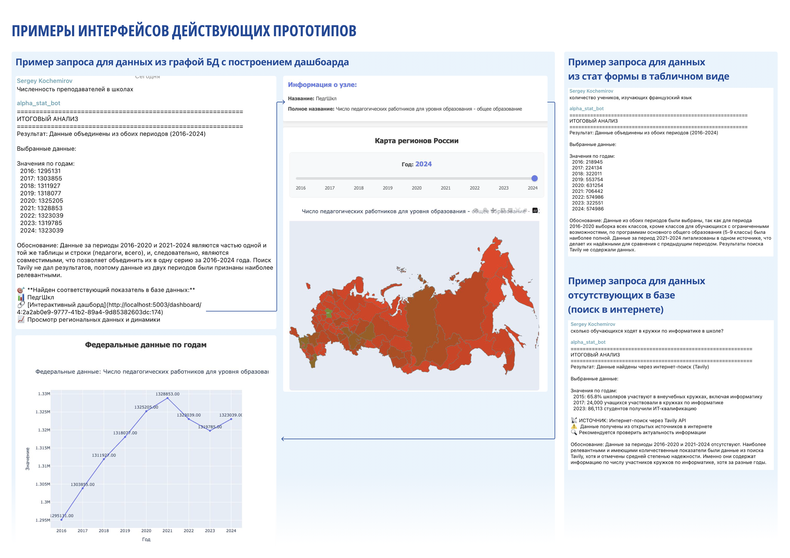

#  Текущий задел

## Прототип 1 (общий) – основные функции

Система анализа статистических форм представляет собой комплексную платформу для интеллектуального анализа образовательных данных Российской Федерации за период 2015-2024 годы. Прототип обеспечивает автоматизированную обработку статистических форм ОО-1 по всем 89 субъектам РФ, включая федеральные и региональные данные общим объемом около 10 лет статистической отчетности.

Ключевой особенностью системы является интеграция современных технологий искусственного интеллекта с традиционными методами обработки данных. Telegram-бот с поддержкой больших языковых моделей (GPT-4o) позволяет пользователям делать естественно-языковые запросы к статистическим данным, получая интеллектуальные ответы с автоматическим поиском релевантной информации через [Neo4j](glossary.md#технологии-работы-с-данными) графовую базу данных или внешние источники. ETL-компонент обрабатывает сложные Excel-файлы с объединенными ячейками и многоуровневыми структурами, создавая узлы в графовой базе данных для последующего анализа.

Веб-интерфейс системы предоставляет интерактивные карты России с региональными показателями и временные ряды данных через Flask Dashboard. Все компоненты координируются центральным System Coordinator. Архитектура построена на модульном принципе с поддержкой как локального, так и облачного развертывания через [Neo4j](glossary.md#технологии-работы-с-данными) Aura Cloud.
Техническая документация:
https://github.com/KochemirovSergey/stat_forms/tree/main/docs

```mermaid
graph TB
    %% Система координации
    subgraph "Система координации"
        COORD[System Coordinator<br/>CLI управление<br/>Health checks<br/>Graceful shutdown]
    end

    %% Пользовательские интерфейсы
    subgraph "Пользовательские интерфейсы"
        TGBOT[Telegram Bot<br/>Естественно-языковые запросы]
        WEBAPP[Web Dashboard<br/>Интерактивные карты и графики]
    end

    %% Обработка запросов
    subgraph "Обработка запросов"
        LLM[LLM интеграция<br/>OpenAI GPT-4o<br/>LangChain<br/>Анализ запросов]
    end

    %% Визуализация
    subgraph "Визуализация"
        VIZ[Визуализация<br/>Plotly карты<br/>Временные ряды<br/>Региональная аналитика]
    end

    %% ETL процессы
    subgraph "ETL процессы"
        DATA[Исходные данные<br/>~850 Excel файлов<br/>2015-2024 годы<br/>89 регионов]
        ETL[ETL компоненты<br/>Excel → CSV → Neo4j<br/>Федеральные данные<br/>Региональные данные]
    end

    %% Внешний поиск
    subgraph "Внешний поиск"
        TAVILY[Tavily Search<br/>Поиск в интернете<br/>Актуальная информация]
    end

    %% Данные и хранение
    subgraph "Данные и хранение"
        NEO4J[Neo4j Graph DB<br/>Сетевые узлы<br/>Расчетные узлы<br/>Региональные данные]
        GEO[Геоданные<br/>russia_regions.parquet<br/>89 регионов РФ]
    end

    %% Связи координации
    COORD --> TGBOT
    COORD --> WEBAPP
    COORD --> ETL

    %% Связи обработки
    TGBOT --> LLM
    LLM --> TAVILY
    LLM --> NEO4J
    
    %% Связи визуализации
    WEBAPP --> VIZ
    VIZ --> NEO4J
    VIZ --> GEO

    %% Связи данных
    DATA --> ETL
    ETL --> NEO4J

    %% Стили
    classDef coordinator fill:#e8f5e8,stroke:#4caf50
    classDef interface fill:#e3f2fd,stroke:#2196f3
    classDef processing fill:#f3e5f5,stroke:#9c27b0
    classDef visualization fill:#fff3e0,stroke:#ff9800
    classDef data fill:#fce4ec,stroke:#e91e63
    classDef search fill:#f1f8e9,stroke:#8bc34a
    classDef storage fill:#fff8e1,stroke:#ffc107

    class COORD coordinator
    class TGBOT,WEBAPP interface
    class LLM processing
    class VIZ visualization
    class DATA,ETL data
    class TAVILY search
    class NEO4J,GEO storage
```

## Прототип 2 – агент-аналитик

Новый прототип системы — это рефакторинг старой версии на базе фреймворка LangGraph. Теперь ключевые методы и обработчики из прежних монолитных модулей оформлены как отдельные инструменты ("tools"), которые интеллектуальный агент может вызывать по мере необходимости — например, для запроса онтологий, данных или генерации диаграмм. Введено общее типизированное состояние (OntologyState), позволяющее передавать результаты работы и вспомогательную информацию между узлами, что повышает прозрачность и управляемость всей логики.

Что уже перенесено:
- Логика интеллектуального анализа и маршрутизации запросов пользователя (классификация запроса как количественного, образовательного или агентского).
- Доступ к базе [Neo4j](glossary.md#технологии-работы-с-данными) и инструменты для получения структуры онтологий и конкретных данных, генерация mermaid-диаграмм на лету.
- Работа с внешним поиском данных (например, Tavily).
- Централизованный контроль итераций и финальной агрегации результата в узле-оценщике.

Что еще не перенесено:
- Интерактивные дашборды и визуализация на Flask/Plotly остаются в старой архитектуре и пока отсутствуют в LangGraph-прототипе.
- ETL-модули (парсинг и загрузка Excel) не интегрированы: в будущем этот слой будет выделен в отдельного агента-парсера, взаимодействующего с основным агентом.
- Telegram-бот и веб-интерфейс нового типа не реализованы.
- Нет региональной детализации и работы со всеми 89 субъектами РФ в этом прототипе.

Таким образом, новый прототип — это модульное "ядро" для интеллектуальной логики и работы с онтологиями, с переносом инструментальных методов из старого монолита и закладкой основной архитектурной шины для интеграции будущих компонентов (ETL, дашборды, интерфейсы) в агентном формате.

Техничексая документация:
https://github.com/KochemirovSergey/agent_analitics

### Сриншоты прототипа

## Целевая архитектура системы

```mermaid
flowchart LR
 subgraph g1["Прогнозно-аналитическая мультиагентная ИИ система анализа социально-экономических показателей сферы образования"]
        n1["Графовая БД"]--1 Получает данные для ответа за запрос-->g5
         subgraph g5["Агент аналитик </br> инструменты"]
            n4[Подбор или расчет индекса в соотвествии с запросом]
            n5[Построение динамического дашборда по реквизитам индекса]
            n6[Расчет прогноза динамики данных]
         end
         subgraph g3["Агент парсер </br> инструменты"]
            n7[Обработка таблицы]
            n8[Поиск в интеренете]
            n9[Обработка текста]
         end
        g3--1 Добавляет данные поиска в интернете-->n1
        g5--1 Если в БД нет данных-->g3
        g3--2 Ежегодная обработка статистических данных-->n1

  end
```