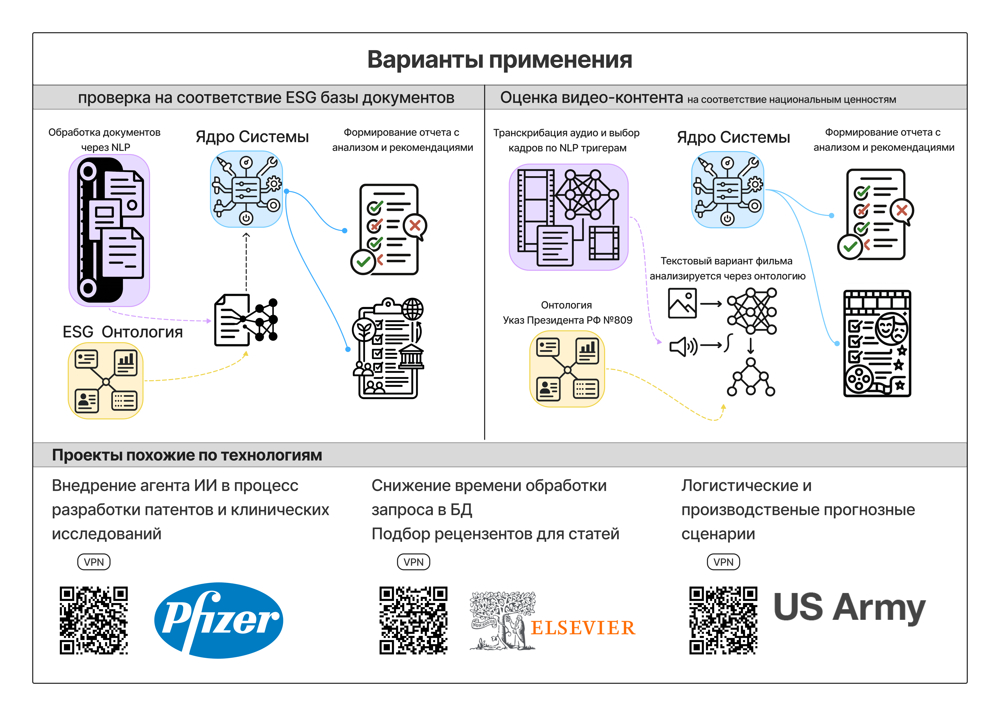

# Сценарии использования

## Сценарий 1: Федеральное министерство планирует образовательную политику

**Участники:** Министерство просвещения РФ, Министерство науки и высшего образования РФ, Рособрнадзор, аппарат Правительства РФ

**Ситуация:** Подготовка стратегического документа по развитию системы образования на 2025-2030 годы требует комплексного анализа текущего состояния всех уровней образования.

**Проблемы существующих решений:**
- **Росстат** предоставляет только 8 статичных дашбордов без возможности глубокой аналитики
- **ВШЭ "Индикаторы образования"** содержит 57 дашбордов, но данные обновляются раз в год и не позволяют строить прогнозные модели

**Решение через нашу систему:** 
GraphRAG-технология анализирует все 750+ статистических таблиц в динамическом режиме, выявляя скрытые взаимосвязи между показателями разных уровней образования. Система генерирует аналитические отчеты с прогнозными сценариями развития системы образования.

**Результат:** Сокращение времени подготовки аналитических материалов с 6 месяцев до 2 недель, повышение качества принимаемых решений за счет использования ИИ-аналитики.

## Сценарий 2: Исследовательский консорциум проводит научный анализ

**Участники:** 
- Федеральные университеты: Казанский федеральный университет (КФУ), Томский государственный университет (ТГУ), Высшая школа экономики (ВШЭ), Московский государственный психолого-педагогический университет (МГППУ), Российская академия народного хозяйства и государственной службы (РАНХиГС)
- Федеральные НИИ: Российская академия образования (РАО), Институт развития профессионального образования (ИРПО), Федеральный институт педагогических измерений (ФИПИ), Федеральный институт оценки качества образования (ФИОКО), Всероссийский научно-исследовательский институт труда и другие профильные институты

**Ситуация:** Консорциум проводит масштабное исследование эффективности образовательных программ по всей России для подготовки научного доклада.

**Проблемы существующих решений:**
- **INVENTORUS** обрабатывает 170 млн патентов и 267 млн публикаций, но не имеет специализированной коллекции по образованию
- Отсутствует возможность анализа российских образовательных данных в контексте мирового научного пространства

**Решение через нашу систему:**
Многоуровневая иерархия данных (федеральный→региональный→организационный) позволяет исследователям получать детализированную аналитику по каждому вузу, сравнивать показатели между регионами и строить корреляционные модели влияния различных факторов на качество образования.

**Результат:** Получение уникальных научных данных, недоступных через существующие платформы, публикация в высокорейтинговых журналах, формирование научно-обоснованных рекомендаций.

## Сценарий 3: Региональное управление образованием оптимизирует ресурсы

**Участники:** 89 региональных департаментов и министерств образования субъектов РФ

**Ситуация:** Департамент образования региона планирует оптимизацию сети образовательных учреждений и распределение бюджетных средств на следующий год.

**Проблемы существующих решений:**
- **Консультант+** (348 млн НПА, выручка 1253 млн ₽) предоставляет только нормативно-правовую информацию без аналитических возможностей
- Отсутствуют инструменты для сравнения эффективности региональных образовательных систем

**Решение через нашу систему:**
Динамическое построение аналитических отчетов позволяет сравнивать показатели региона с другими субъектами РФ, выявлять лучшие практики, прогнозировать потребности в образовательных услугах на основе демографических и экономических трендов.

**Результат:** Обоснованное распределение бюджетных средств, повышение эффективности региональной образовательной системы, сокращение неэффективных расходов на 15-20%.

## Сценарий 4: Образовательная организация развивает программы

**Участники:** Вузы, EdTech стартапы, платформы онлайн-образования, консалтинговые компании в сфере образования, разработчики образовательного контента

**Ситуация:** Частный университет планирует запуск новых образовательных программ и хочет оценить перспективы их востребованности на рынке труда.

**Проблемы существующих решений:**
- **Руспрофайл** (39 источников данных, выручка 668 млн ₽) предоставляет только реестр лицензий Рособрнадзора без аналитики качества образования
- **HolonIQ** ориентирована на глобальный рынок без глубокого понимания специфики российского образования

**Решение через нашу систему:**
Комплексный анализ включает: конкурентный анализ образовательных организаций, анализ трудоустройства выпускников по специальностям, прогнозирование популярных программ на основе данных рынка труда, анализ востребованных компетенций у работодателей.

**Результат:** Научно-обоснованное планирование образовательных программ, повышение трудоустройства выпускников, увеличение конкурентоспособности на образовательном рынке.

## Сценарий 5: Гражданин ищет образовательные возможности

**Участники:** Граждане РФ (потенциально 146 млн человек)

**Ситуация:** Житель Екатеринбурга, работающий в IT-сфере, хочет получить дополнительное образование в области управления проектами. Обращается к Telegram-боту системы с запросом: "Где можно пройти обучение по управлению проектами в Екатеринбурге или онлайн? Какие программы дают лучшие перспективы трудоустройства?"

**Проблемы существующих решений:**
Все рассмотренные аналоги (Консультант+, Руспрофайл, INVENTORUS, ВШЭ, Росстат, HolonIQ) требуют платной подписки или предоставляют информацию в неудобном для обычного пользователя формате.

**Решение через нашу систему:**
- Персонализированный поиск программ обучения по региону и специальности
- Сравнение качества образовательных организаций на основе реальных данных о трудоустройстве выпускников
- Информация о средней заработной плате специалистов по интересующему направлению
- Рекомендации программ обучения на основе анализа рынка труда и карьерных траекторий
- Удобный интерфейс через Telegram-бот с возможностью задать уточняющие вопросы

**Результат:** Гражданин получает качественную аналитическую информацию бесплатно, принимает обоснованное решение о выборе образовательной программы. Система получает обратную связь для улучшения рекомендательных алгоритмов.

## Альтернативные применения

