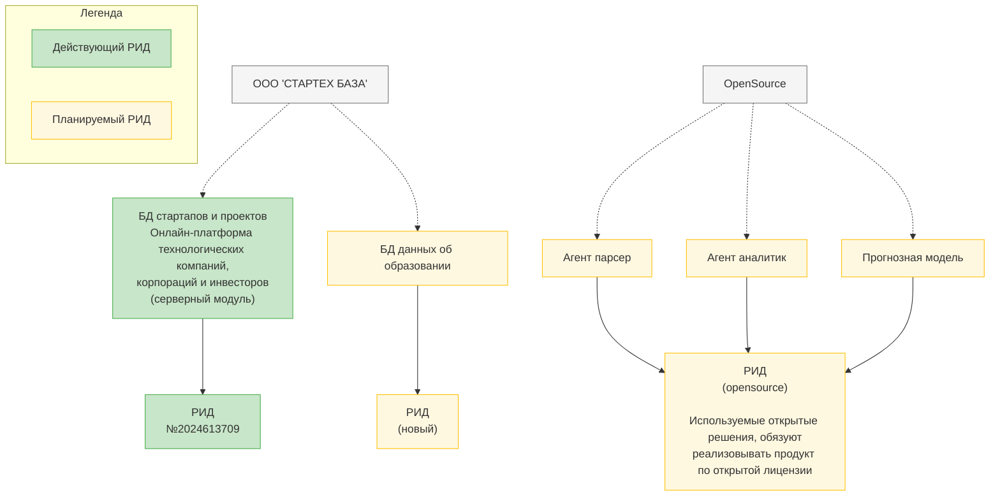

### 2.6. Планы по созданию и защите интеллектуальной собственности

[← Назад к оглавлению](#оглавление)

#### Авторские права

[Добавить научные статьи]

#### Стратегия защиты интеллектуальной собственности и технологического суверенитета

Основные принципы разработки:

1. **Гибридная модель открытого кода**: Базовые компоненты архитектуры будут разработаны как open source проект для привлечения международного сообщества разработчиков и обеспечения прозрачности технологических решений.

2. **Защищенное ядро технологии**: Критически важные алгоритмы, специализированные модели и данные будут защищены авторскими правами РФ и доступны только для верифицированных российских организаций.

3. **Локализация ключевых компонентов**: Документация, интерфейсы и специализированные решения для государственного сектора будут реализованы на русском языке с ограниченным доступом.

4. **Стратегия привлечения международных экспертов**: Через открытые компоненты и исследовательские партнерства привлекать лучших специалистов мирового уровня для развития базовых технологий, при сохранении контроля над стратегически важными разработками.

5. **Идеологическая позиция открытости**: Продвижение принципов открытого кода как инструмента технологического развития и международного сотрудничества, с акцентом на взаимную выгоду и совместное развитие технологий.
