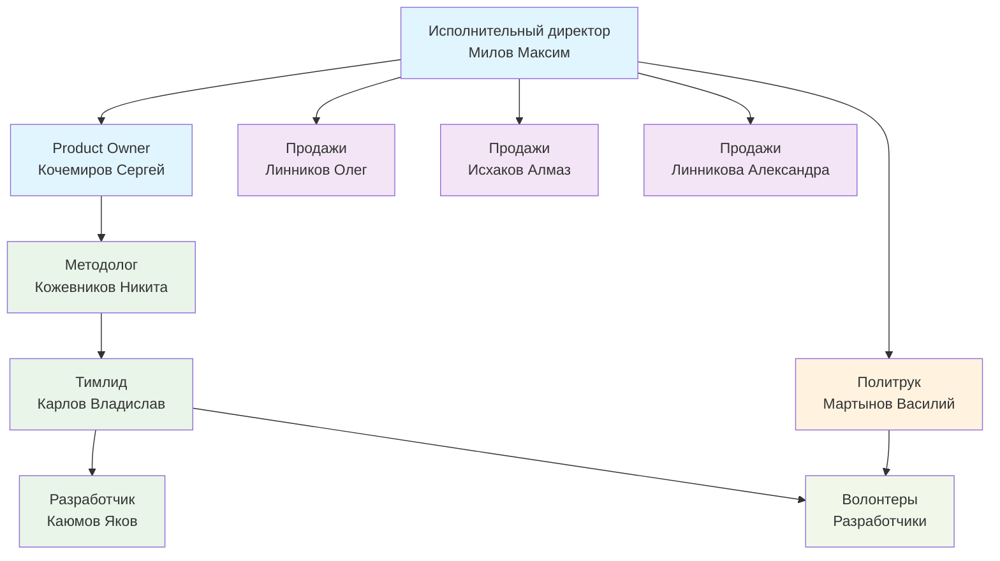
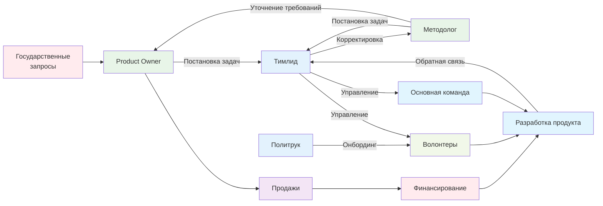

### 4.1. Количество сотрудников, в том числе занятых выполнением проекта, направления их деятельности и их квалификация с приложением подтверждающих документов

[← Назад к оглавлению](#оглавление)

Таблица № 3
| № п/п | ФИО сотрудника                | Тип трудоустройства      | Роль в команде проекта | Квалификация               | Опыт реализации проектов по схожей тематике (разработка/коммерциализация)                           |
|-------|-------------------------------|-------------------------|------------------------|----------------------------|-----------------------------------------------------------------------------------------------------|
| 1     | Линников Олег Михайлович      | Штат                    | Продажи          | МФТИ                       | Разработка платформы БД стартапов; Продажи БД стартапов                                             |
| 2     | Милов Максим Владимирович     | Штат                    | Исполнительный директор           | МФТИ                       | Разработка платформы БД стартапов; Продажи БД стартапов                                             |
| 3     | Кочемиров Сергей Алексеевич   | Совместительство        | Product owner          | МФТИ, классный чин         | ГИСы, системы управления образованием и образовательными организациями                              |
| 4     | Кожевников Никита Александрович | Совместительство        | Методолог               | МФТИ                       | ГИСы, системы управления образованием и образовательными организациями                              |
| 5     | Карлов Владислав Валерьевич   | Совместительство        | Тимлид            | МФТИ                       | Реализация интерфейсов, работа в крупных ИТ компаниях, высокие компетенции в разработке             |
| 6     | Исхаков Алмаз                 | Совместительство        | Продажи                | МФТИ                       | ГИСы, системы управления образованием и образовательными организациями                              |
| 7     | Мартынов Василий              | Совместительство        | Политрук                     | МФТИ                       | ГИСы, системы управления образованием и образовательными организациями                              |
| 8     | Линникова Александра Олеговна | Совместительство        | Продажи                | БД стартапов               | БД стартапов                                                                                        |
| 9     | Каюмов Яков Габдулаевич       | Совместительство        | Разработчик            | МФТИ                       | БД стартапов                                                                                        |
_____________________
#### Организационная структура команды

______________________
#### Процессы взаимодействия ролей

