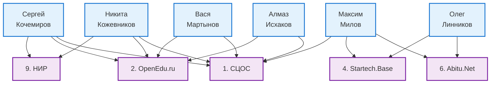
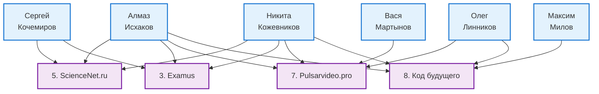

### 4.2. Опыт команды в реализации подобных проектов.

[← Назад к оглавлению](#оглавление)

**1. [Современная цифровая образовательная среда (СЦОС)](https://www.tadviser.ru/index.php/%D0%A1%D1%82%D0%B0%D1%82%D1%8C%D1%8F:%D0%A1%D0%BE%D0%B2%D1%80%D0%B5%D0%BC%D0%B5%D0%BD%D0%BD%D0%B0%D1%8F_%D1%86%D0%B8%D1%84%D1%80%D0%BE%D0%B2%D0%B0%D1%8F_%D0%BE%D0%B1%D1%80%D0%B0%D0%B7%D0%BE%D0%B2%D0%B0%D1%82%D0%B5%D0%BB%D1%8C%D0%BD%D0%B0%D1%8F_%D1%81%D1%80%D0%B5%D0%B4%D0%B0_%D0%B2_%D0%A0%D0%BE%D1%81%D1%81%D0%B8%D0%B9%D1%81%D0%BA%D0%BE%D0%B9_%D0%A4%D0%B5%D0%B4%D0%B5%D1%80%D0%B0%D1%86%D0%B8%D0%B8_(%D0%A1%D0%A6%D0%9E%D0%A1))**

- **Тип:** Федеральный проект, государственная информационная система (ГИС)
- **Рынок:** EdTech, GovTech
- **Описание:** Инфраструктурная платформа для аналитики и автоматизации процессов учета в школах и вузах по федеральным требованиям.
- **Схожесть:** ГИС, федеральный уровень, аналитика, соответствие EdTech/GovTech

**2. [Национальная платформа открытого образования (OpenEdu.ru)](https://openedu.ru/)**

- **Тип:** Образовательная платформа
- **Рынок:** EdTech, Science
- **Описание:** Онлайн-курсы ведущих вузов, интеграция с университетами, прокторинг, контроль качества и аналитика образовательных данных.
- **Схожесть:** EdTech, платформа, обработка и анализ образовательных данных

**3. [Examus — система прокторинга](https://ru.examus.net/)**

- **Тип:** Бизнес-решение, облачный сервис
- **Рынок:** EdTech
- **Описание:** Онлайн-прокторинг экзаменов с биометрией, аналитикой нарушений и автоматизацией контроля для учебных заведений.
- **Схожесть:** EdTech, аналитика, автоматизация, контроль образовательных процессов

**4. [Startech.Base](https://base.startech.vc/)**

- **Тип:** Онлайн-платформа, бизнес-проект
- **Рынок:** Science, GovTech, EdTech (частично)
- **Описание:** Единая база данных и аналитики для технологических компаний, сервис для отраслевых инвесторов, бизнес и научные проекты.
- **Схожесть:** Платформа, аналитика, мультиотраслевое решение, база данных

**5. [ScienceNet.ru](https://sciencenet.ru/)**

- **Тип:** Федеральная платформа, ГИС
- **Рынок:** Science, GovTech
- **Описание:** Инструмент обмена информацией среди научных организаций, агрегатор публикаций и грантов, аналитика проектов и отчетность.
- **Схожесть:** ГИС, аналитика, профиль научных данных

**6. [Abitu.Net](https://abitu.net/)**

- **Тип:** Социальная сеть / EdTech-платформа
- **Рынок:** EdTech
- **Описание:** Платформа для взаимодействия школьников, абитуриентов и вузов, учет контингента, коммуникация, образовательная аналитика.
- **Схожесть:** EdTech, коммуникация и учет контингентов, аналитика

**7. [Pulsarvideo.pro](https://pulsarvideo.pro/)**

- **Тип:** Видеопродакшн для EdTech/бизнеса
- **Рынок:** EdTech, образовательный контент
- **Описание:** Разработка видеокурсов, презентаций, видео для онлайн-школ и образовательных платформ на заказ.
- **Схожесть:** Контент для EdTech/цифровых платформ, мультимедийные образовательные решения

**8. [Код будущего](https://kodfuture.ru/)**

- **Тип:** Федеральный образовательный проект
- **Рынок:** EdTech, Science (частично)
- **Описание:** Массовое бесплатное обучение программированию и IT для школьников и студентов, онлайн/офлайн, олимпиады, аналитика результатов.
- **Схожесть:** EdTech, массовое обучение, платформа, аналитика успеваемости

**9. Разработка научно-исследовательской работы (НИР)**

**Разработка справочных, экспертно-аналитических материалов, проектов нормативных документов в рамках подготовки и реализации мероприятий Федерального проекта «Кадры для цифровой экономики»**

- **Тип:** Научно-исследовательская работа (НИР), аналитический проект Регистрационный номер: [АААА-А19-119060590113-6](https://gisnauka.ru/nioktr/detail/G8I6MSRMD2STSQ2YTLZ5XYLM)
- **Рынок:** EdTech, GovTech (кадры и образование), Science (образовательные технологии)
- **Описание:** Экспертно-аналитические исследования, разработка паспортов мероприятий, формирование нормативных и методических документов для федеральных разработчиков, центров компетенций и органов власти, создание модели «Цифровой университет», цифровые образовательные симуляторы, разработка и актуализация концепции цифровой грамотности. Проведение аналитических, нормативных и экспертных работ на федеральном уровне для интеграции цифровых технологий в систему образования и кадровой подготовки.
- **Схожесть:** Аналитика, экспертные исследования, нормативное сопровождение федеральных EdTech/GovTech проектов, цифровая трансформация образования

#### Схема участия команды в проектах

