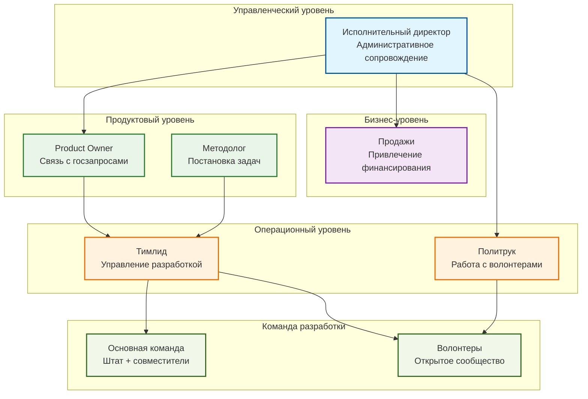

### 4.3. Организационная структура управления. Схема привлечения новых специалистов.

[← Назад к оглавлению](#оглавление)

#### Схема ответственности и взаимодействия

#### Волонтерская модель развития

Проект имеет социальную направленность и характер близкий к НКО. Развитие опенсорс направления в применении ИИ для государственного управления является альтернативной ценностью. Привлечение волонтеров — ключевой элемент стратегии со конверсией 0,01% из рекламы для снижения издержек. При выручке 20 млн можно привлечь до 86 волонтеров.

**Система привлечения и удержания волонтеров**

**Компоненты привлечения:**
- Таргетированная реклама в образовательных Telegram-каналах (конверсия 0,01%)
- Публикации в научных журналах и на технологических платформах (Habr, VC.ru)
- Участие в профильных конференциях (ММСО.EXPO, Архимед)
- Открытые вебинары и мастер-классы по применению ИИ в образовании
- GitHub-репозиторий и техническая документация для разработчиков
- Прямые рассылки через контакты в министерствах и ведомствах
- Научный семинар как контент маркетинг

**Компоненты удержания:**
- Качественный онбординг для понимания сложного академического проекта
- Грамотн нарезанные задачи маленькими кусочками
- Контроль качества при включении результатов работы
- Онлайн и очные синхронные мероприятия

**Ключевые роли и их функции**
_________________

| Роль | Функция в системе удержания |                           |
|------|----------------------------|----------------------------|
| Политрук | Качественный онбординг |научный семинар |
| Методолог | Консультации волонтеров по сложным вопросам |научный семинар |
| Тимлид | Постановка задач для коллективного исполнения, контроль качества | |
| Product Owner | Связь задач с запросами государства, идеологическая основа |научный семинар |
| Бизнесмены | Привлечение дополнительного финансирования | |
| Исполнительный директор | Административное сопровождение | |

Также все участники проекта имеют навыки разработки и совместно участвуют в развитии кодовой базы.
___________________

**Идеологические основы мотивации**
Стратегия формирования команды базируется на идеологической мотивации и создании устойчивого профессионального сообщества для решения государственных задач. Приоритет отдается нематериальным стимулам:
- **Патриотическая миссия** — осознание исторической ответственности за технологический суверенитет России. Понимание уникальной роли отечественных специалистов в создании прорывных решений для государственного управления.
- **Технологическое лидерство в ИИ** — возможность участвовать в разработке инновационных методов взаимодействия человека и искусственного интеллекта на передовых рубежах науки.
- **Профессиональное развитие** — получение экспертизы в области применения ИИ для решения комплексных управленческих задач государственного масштаба. Научный семинар позволяет всем перекрестно обогащаться практическим опытом от решаемых задач в проекте. Каждый учит каждого.
- **Исследовательская деятельность** — участие в пионерских исследованиях возможностей ИИ в сферах управления беспрецедентной сложности. Государственные процессы характеризуются масштабами и многоуровневой архитектурой, недоступными коммерческим структурам, что порождает уникальные эмерджентные свойства системы управления.